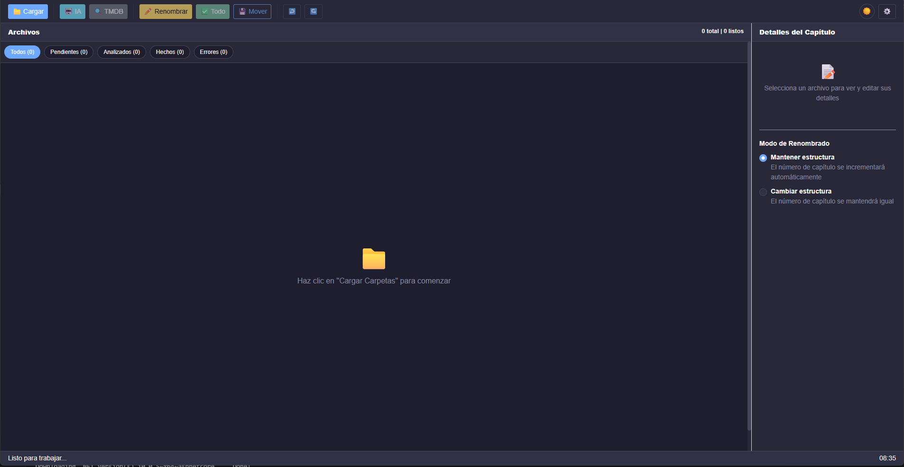

**OrganizadorCapitulos.Maui**

 



OrganizadorCapitulos.Maui es una aplicación de escritorio desarrollada específicamente para Windows (interfaz Blazor embebida en .NET MAUI) diseñada para ayudar a organizar, renombrar y mover archivos de capítulos/episodios de series de forma rápida y segura. La app combina una interfaz moderna con lógica reutilizable en `SharedLogic` y herramientas auxiliares como un script Python para limpieza de nombres.

**Descripción breve**:
- **Qué hace:** escanea carpetas, detecta archivos de video, propone nombres limpios (incluyendo sugerencias asistidas por IA), renombra y mueve archivos evitando colisiones.
- **Interfaz:** UI construida con .NET MAUI + BlazorWebView (componentes Razor) para una experiencia moderna y responsive.
- **Arquitectura:** lógica central en `SharedLogic` (servicios, estrategias, entidades) y capa MAUI que orquesta la interacción y presenta la interfaz.

**Características principales**
- **Carga por arrastrar y soltar** y explorador de carpetas.
- **Análisis y limpieza de nombres** (algoritmos locales + script Python de apoyo: `Python/ai_service.py`).
- **Sugerencias IA (hook)** — infraestructura preparada para usar un servicio Python/externo (se incluye un stub en `SharedLogic/Infrastructure/Services/PythonAIService.cs`).
- **Renombrado y movimiento seguro** con detección de colisiones y generación de nombres únicos (`SharedLogic/Application/Services/FileOrganizerService.cs`).
- **Deshacer/Rehacer** operaciones mediante `UndoRedoService`.
- **Búsqueda TMDB** integrada (interfaz para buscar metadatos de series).

- **Tecnologías**
- **Plataforma objetivo:** Windows (compilación dirigida a `net9.0-windows10.0.19041.0`). Este repositorio está configurado y mantenido para compilar únicamente en Windows.
- **Runtime / UI:** .NET MAUI (BlazorWebView) sobre Windows
- **Librerías:** CommunityToolkit.Maui, CommunityToolkit.Mvvm
- **Script auxiliar:** Python 3 (script en `Python/ai_service.py`)

**Archivos relevantes**
- Proyecto MAUI: [OrganizadorCapitulos.Maui.csproj](OrganizadorCapitulos.Maui.csproj#L1)
- Lógica de organización de archivos: [SharedLogic/Application/Services/FileOrganizerService.cs](SharedLogic/Application/Services/FileOrganizerService.cs#L1)
- ViewModel principal / flujo UI: [ViewModels/HomeViewModel.cs](ViewModels/HomeViewModel.cs#L1)
- Página principal (Blazor): [Components/Pages/Home.razor](Components/Pages/Home.razor#L1)
- Script de limpieza de nombres (Python): [Python/ai_service.py](Python/ai_service.py#L1)

**Requisitos**
- .NET 9 SDK y workloads de MAUI instalados (Visual Studio con workload MAUI o `dotnet workload install maui`).
- Python 3 si se desea ejecutar o desarrollar el script auxiliar de limpieza / IA.

**Instalación y ejecución rápida (Windows / desarrollo)**
1. Abrir la solución/proyecto en Visual Studio con workloads de MAUI o usar CLI.
2. Restaurar paquetes y compilar:

```
dotnet restore
dotnet build
```

3. Ejecutar la app (ejemplo por CLI):

```
dotnet run --project OrganizadorCapitulos.Maui.csproj
```

Nota: este proyecto se mantiene para compilación en Windows; las instrucciones y scripts de empaquetado para Android/iOS/Mac Catalyst han sido retirados de este README.

**Uso del script Python (opcional)**
- Para probar localmente el limpiador de nombres:

```
python Python/ai_service.py --help
```

El proyecto copia `Python/ai_service.py` al output para facilitar llamadas externas (ver `OrganizadorCapitulos.Maui.csproj`).

**Cómo contribuir**
- Reporta issues o sugiere mejoras.
- Para cambios en la lógica de renombrado, edita `SharedLogic` (servicios y estrategias) y añade tests.
- Si añades integración IA real, implementa `IAIService` en `Infrastructure/Services` y actualiza la vista para controlar disponibilidad.

**Notas y recomendaciones**
- No se incluye licencia en el repositorio; añade un archivo `LICENSE` si planeas publicar con una licencia concreta.
- Hay un stub de `PythonAIService` en `SharedLogic/Infrastructure/Services` que actualmente no llama al script Python.


—

Si quieres, puedo:
- Añadir badges (build, license) al README. (hecho)
- Crear instrucciones detalladas de publicación para Windows/Android/iOS. (hecho)
- Documentar la API interna y puntos de extensión (IA, metadata providers). (hecho)

**Publicación (resumen y comandos)**

Windows (desarrollo / paquete sin MSIX):

```
dotnet publish -f net9.0-windows10.0.19041.0 -c Release -r win10-x64 --self-contained false -o ./publish/windows
```

Para crear paquete MSIX desde Visual Studio: seleccione `Publish` → `Create App Packages` y siga el asistente. Para la Microsoft Store siga la guía oficial de MAUI.

**Publicación (Windows)**

Publicación para Windows (ejemplo: build de Release dirigida a Windows 10+):

```
dotnet publish -f net9.0-windows10.0.19041.0 -c Release -r win10-x64 --self-contained false -o ./publish/windows
```

Para crear un paquete MSIX empaquetado y subir a la Microsoft Store, use Visual Studio: `Publish` → `Create App Packages` y siga el asistente. Consulte la documentación oficial de .NET MAUI y Microsoft Store para requisitos adicionales.

**API y extensibilidad (dónde tocar)**

Puntos de extensión bien definidos para integrar nuevas funcionalidades:

- `IAIService` / `PythonAIService` (ruta: `SharedLogic/Infrastructure/Services`): implemente `IAIService` para conectar el script Python `Python/ai_service.py` u otro servicio externo. El stub actual retorna `null` y `IsAvailable()` = `false`.
- `IMetadataService` (implementaciones en `OrganizadorCapitulos.Maui/Services`): usado para obtener metadatos (TMDB). Sustituya o extienda para integrar otras fuentes.
- `RenameStrategyFactory` y las estrategias (`SharedLogic/Application/Strategies`): añade nuevas reglas de renombrado o modifica las existentes.
- `FileOrganizerService` (`SharedLogic/Application/Services/FileOrganizerService.cs`): flujo principal para cargar, renombrar y mover archivos — buen lugar para instrumentación y validaciones adicionales.

Recomendaciones de integración Python:

- Para llamar al script `Python/ai_service.py` desde .NET, use `System.Diagnostics.Process` o un pequeño servidor HTTP local en Python y comuníquese por HTTP/JSON.
- Asegure manejo de errores y timeouts. Mantenga `IsAvailable()` como gate para la UI.
